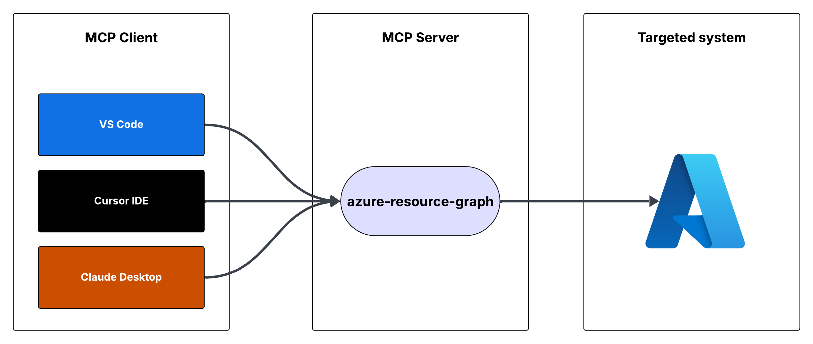

# Demo


# Flow



# Azure Resource Graph MCP Server

This is a Model Context Protocol (MCP) server that provides access to Azure Resource Graph queries. It allows you to retrieve information about Azure resources across your subscriptions using Resource Graph queries.

## Features

- Query Azure resources using Resource Graph queries
- Default query returns resource ID, name, type, and location
- Supports custom Resource Graph queries
- Uses Azure DefaultAzureCredential for authentication

## Prerequisites

- Node.js installed
- Azure subscription
- Azure CLI installed and logged in, or other Azure credentials configured

## Running the MCP Server

You can run the MCP server using either Cursor IDE or Visual Studio Code.

### Option 1: Cursor IDE Integration

To integrate the MCP server with Cursor IDE:

1. Clone this repository to your local machine (e.g., `C:\YOUR_WORKSPACE\azure-resource-graph-mcp-server`)
2. Build the project:
```bash 
npm install
npm run build
```
3. Open Cursor Settings (JSON) and add the following configuration:
```json
{
  "mcpServers": {
    "azure-resource-graph-mcp-server": {
      "command": "node",
      "args": [
        "C:\\YOUR_WORKSPACE\\azure-resource-graph-mcp-server\\build\\index.js"
      ],
      "env": {
        "SUBSCRIPTION_ID": "xxxxxx-xx-xx-xx-xxxxxx"
      },
    }
  }
}
```
> **Note**: Make sure to update the path to match your local repository location.

4. Restart Cursor IDE to apply the changes

### Option 2: VS Code Integration

To integrate the MCP server with Visual Studio Code:

1. Clone this repository to your local machine
2. Build the project:
```bash 
npm install
npm run build
```
3. Open VS Code Settings (JSON) by pressing `Ctrl+Shift+P`, type "Settings (JSON)" and select "Preferences: Open User Settings (JSON)"
4. Add the following configuration:
```json
{
    "mcp": {
        "servers": {
            "azure-resource-graph": {
                "type": "stdio",
                "command": "node",
                "args": [
                    "C:\\YOUR_WORKSPACE\\azure-resource-graph-mcp-server\\build\\index.js"
                ],
                "env": {
                  "SUBSCRIPTION_ID": "xxxxxx-xx-xx-xx-xxxxxx"
                },
            }
        }
    }
}
```
> **Note**: Make sure to update the path to match your local repository location.

5. Save the settings.json file
6. Restart VS Code to apply the changes

The MCP server will now be available to use within VS Code with cursor integration.

## Usage

The server provides the following tool:

### query-resources

Retrieves resources and their details from Azure Resource Graph.

Parameters:
- `subscriptionId` (optional): Azure subscription ID (defaults to configured ID)
- `query` (optional): Custom Resource Graph query (defaults to "Resources | project id, name, type, location")

## Environment Setup

1. First, make sure you're logged in to Azure CLI by running:
   ```bash
   az login
   ```
   This step is crucial for local development as the DefaultAzureCredential will automatically use your Azure CLI credentials.

2. Set up your environment variables:
   - Copy `.env.example` to `.env`
   - Update `AZURE_SUBSCRIPTION_ID` in `.env` with your actual subscription ID
   - Other variables (`AZURE_TENANT_ID`, `AZURE_CLIENT_ID`, `AZURE_CLIENT_SECRET`) are optional when using Azure CLI authentication

3. Make sure you have proper Azure credentials configured. The server uses DefaultAzureCredential which supports:
   - Azure CLI
   - Managed Identity
   - Visual Studio Code credentials
   - Environment variables

4. If using environment variables, set up:
   - AZURE_SUBSCRIPTION_ID
   - AZURE_TENANT_ID
   - AZURE_CLIENT_ID
   - AZURE_CLIENT_SECRET

## Error Handling

The server includes robust error handling for:
- Azure client initialization failures
- Query execution errors
- Invalid queries or parameters

## Development

To work on this project:

1. Make changes in the `src` directory
2. Build using `npm run build`
3. Test your changes by running the server

## License
This project is licensed under the MIT License. See the [LICENSE](./LICENSE) file for details.


<a href="https://glama.ai/mcp/servers/@hardik-id/azure-resource-graph-mcp-server">
  
</a>
